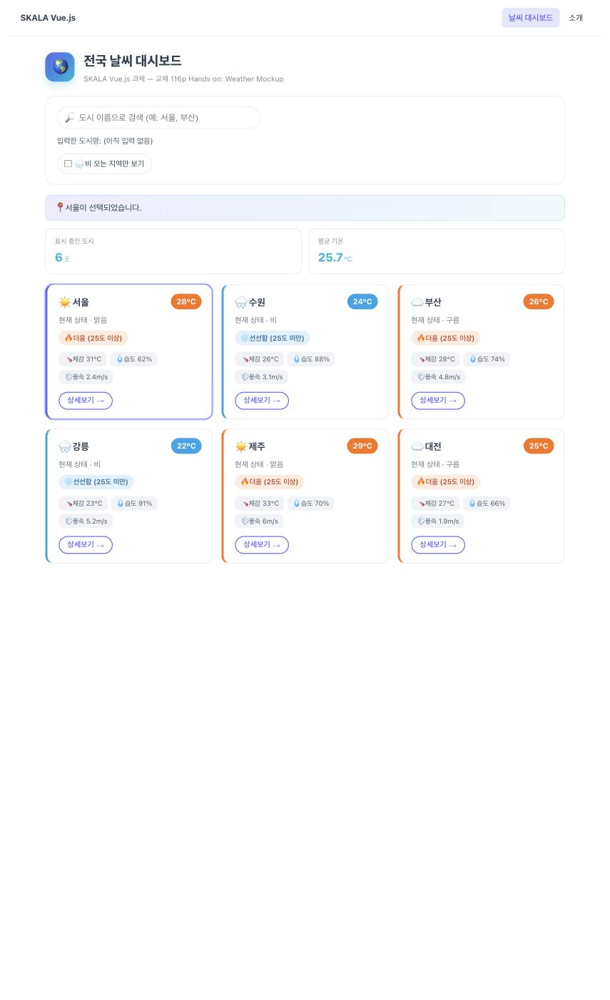
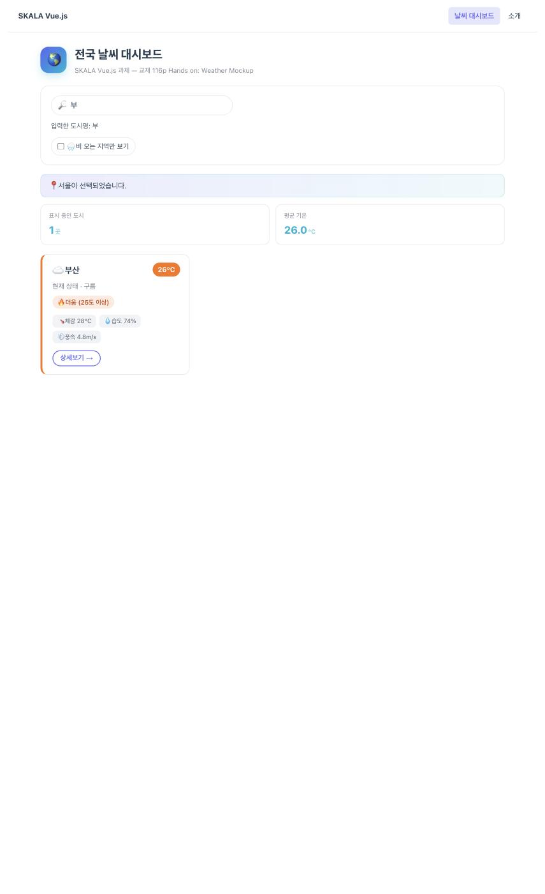
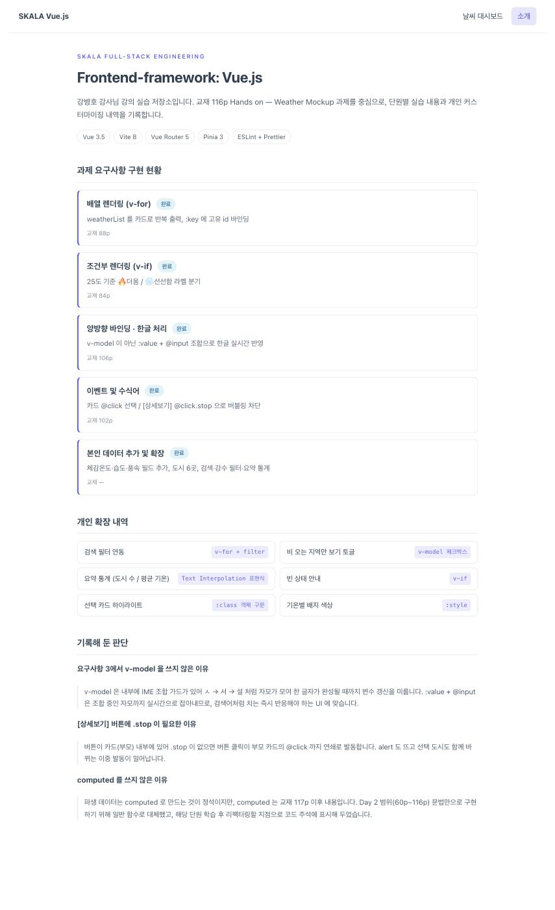

# skala-vue

SKALA Full-Stack Engineering — **Frontend-framework: Vue.js** (강병호 강사님, 2026.08.18 ~ 08.21) 실습/과제 저장소입니다.

- **소스코드**: https://github.com/jang961111-hash/skala-vue
- **배포**: https://jang961111-hash.github.io/skala-vue/
- **스택**: Vue 3.5 (`<script setup>` + Composition API) · Vite 8 · Vue Router 5 · ESLint + Prettier
- **설치돼 있으나 아직 미사용**: Pinia 3 (교재 store 단원에서 사용 예정)

## 화면

| 대시보드 (`/`)                                 | 검색 필터                                      | 소개 (`/about`)                        |
| ---------------------------------------------- | ---------------------------------------------- | -------------------------------------- |
|  |  |  |

배포본에서 직접 확인: <https://jang961111-hash.github.io/skala-vue/>

---

## 실행 방법

```bash
npm install
npm run dev        # 개발 서버 (http://localhost:5173)
npm run build      # 프로덕션 빌드 → dist/
npm run preview    # 빌드 결과를 정적 파일로 미리보기
npm run lint       # oxlint + eslint
npm run format     # prettier
```

---

## 라우팅

| 경로     | 화면        | 내용                            |
| -------- | ----------- | ------------------------------- |
| `/`      | `HomeView`  | 교재 116p 과제 — Weather Mockup |
| `/about` | `AboutView` | 소개 페이지                     |

`App.vue`에서 `<RouterLink>`로 주소만 바꾸고 `<RouterView />` 구역이 갈아 끼워지는 SPA 구조입니다.

---

## 프로젝트 구조

```
src/
├── main.js                          # createApp → Pinia/Router 등록 → mount('#app')
├── App.vue                          # Root Component (nav + RouterView)
├── router/index.js                  # 라우트 정의
├── assets/
│   ├── base.css                     # 리셋/변수
│   └── main.css                     # 전역 스타일 (스캐폴드 2단 grid 제거)
├── stores/counter.js                # create-vue 기본 store — 아직 미사용 (store 단원에서 교체 예정)
├── views/
│   ├── HomeView.vue                 # "/" → WeatherMockup 마운트
│   └── AboutView.vue                # "/about" 소개 페이지
└── components/
    └── handson/
        └── WeatherMockup.vue        # 교재 116p 과제 본체
docs/screenshots/                    # README용 화면 캡처
.github/workflows/deploy.yml         # GitHub Pages 자동 배포
```

create-vue 스캐폴드가 만들어 준 예제 컴포넌트(`HelloWorld` / `TheWelcome` / `WelcomeItem` / `icons/*`)는 사용하지 않으므로 삭제했습니다.

### 사용 중인 Vue API

전 컴포넌트가 `<script setup>` 기반 **Composition API** 로 작성돼 있습니다.

| API              | 사용처                                                                                                                                       |
| ---------------- | -------------------------------------------------------------------------------------------------------------------------------------------- |
| `ref()`          | `WeatherMockup.vue` (`weatherList` / `searchQuery` / `selectedCityInfo` / `onlyRainy`), `AboutView.vue` (`requirements` / `extras`) — 총 7곳 |
| `<script setup>` | 모든 `.vue` 파일                                                                                                                             |

`computed` / `watch` 는 교재 진도상 아직 학습 전이라 의도적으로 쓰지 않았습니다. (아래 "의도적으로 쓰지 않은 것" 참고)

---

## 단원별 Customization 기록

### Day 1 (08/18) — 개발환경 구성 & Vue 기초

| 항목              | 내역                                                                                                                                       |
| ----------------- | ------------------------------------------------------------------------------------------------------------------------------------------ |
| 프로젝트 생성     | `npm create vue@3.22.3` — Router / Pinia / ESLint / Prettier 선택, TypeScript·JSX·Vitest·E2E 미선택                                        |
| 개인 커스터마이징 | `AboutView.vue` 의 문구를 `Welcome to SKALA-VUE project!` 로 변경                                                                          |
| 확인한 것         | `index.html` → `main.js` → `App.vue` → 자식 컴포넌트로 이어지는 부트스트랩 체인, SFC 3단 구조(`<script setup>` / `<template>` / `<style>`) |

### Day 2 (08/19) — Vue Syntax (60p ~ 116p)

**교재 116p Hands on: Weather Mockup** 을 `src/components/handson/WeatherMockup.vue` 로 구현했습니다.

#### 요구사항 대비 구현

| #   | 요구사항               | 구현                                                                      | 교재      |
| --- | ---------------------- | ------------------------------------------------------------------------- | --------- |
| 1   | 배열 렌더링 (`v-for`)  | `weatherList` 배열을 카드로 반복 출력, `:key="city.id"` 바인딩            | 88p       |
| 2   | 조건부 렌더링 (`v-if`) | 25도 기준 `🔥 더움` / `❄️ 선선함` 라벨 분기                               | 84p       |
| 3   | 입력 바인딩 (IME 대응) | `:value` + `@input` 조합으로 한글 도시 검색                               | 106p      |
| 4   | 이벤트 및 수식어       | 카드 `@click` → 상태바 표기 / `[상세보기]` `@click.stop` → `window.alert` | 96p, 102p |
| 5   | 본인 데이터 추가       | 아래 "개인 확장" 참고                                                     | —         |

#### 요구사항 3을 `v-model` 대신 `:value` + `@input` 으로 쓴 이유

교재 요구사항에 명시된 방식이며, 한글 입력과 직결됩니다.
`v-model` 은 내부에 IME 조합(composition) 가드를 갖고 있어, `ㅅ → 서 → 설` 처럼 자모가 모여 한 글자가 완성될 때까지 변수 갱신을 미룹니다.
반면 `:value` + `@input` 은 조합 중인 자모까지 실시간으로 잡아내므로, 검색어 자동완성처럼 "치는 즉시" 반응해야 하는 UI 에 맞습니다.

같은 문서 안에서 "비 오는 지역만 보기" 체크박스에는 `v-model` 을 그대로 씁니다. 체크박스는 문자 입력이 아니라 boolean 토글이라 IME 조합 자체가 없기 때문입니다. 즉 `v-model` 을 피한 것이 아니라, **IME 가 개입하는 텍스트 입력에서만** 피한 것입니다.

#### 요구사항 4의 `.stop` 이 필요한 이유

`[상세보기]` 버튼이 카드(부모) 내부에 있어, `.stop` 이 없으면 버튼 클릭이 부모 카드의 `@click` 까지 연쇄로 발동합니다(이벤트 버블링).
그 결과 alert 도 뜨고 상태바의 선택 도시도 함께 바뀌는 이중 발동이 일어납니다.
`.stop` 은 내부적으로 `e.stopPropagation()` 을 대신 호출해 줍니다.

#### 개인 확장 (요구사항 5)

교재가 준 데이터는 `id / name / temp / status` 4개 필드에 도시 3곳이었습니다. 여기에 다음을 추가했습니다.

| 확장            | 내용                                                                             | 사용 문법                          |
| --------------- | -------------------------------------------------------------------------------- | ---------------------------------- |
| 데이터 필드     | `humidity`(습도) · `wind`(풍속) · `feelsLike`(체감온도) 추가, 도시 3곳 → **6곳** | —                                  |
| 검색 연동       | 요구사항 3의 입력값을 실제 카드 목록 필터에 연결                                 | `v-for` + 배열 `filter`            |
| 강수 필터       | "비 오는 지역만 보기" 토글                                                       | `v-model` 단일 체크박스 (108p)     |
| 요약 통계       | 표시 중인 도시 수 / 평균 기온                                                    | Text Interpolation 내 표현식 (71p) |
| 빈 상태 안내    | 조건에 맞는 도시가 없을 때 안내 문구 노출                                        | `v-if`                             |
| 선택 하이라이트 | 선택된 카드에만 클래스 부착                                                      | `:class` 객체 구문 (79p)           |
| 기온별 색상     | 기온에 따라 배지 색 변경                                                         | `:style` (81p)                     |

#### 시각 디자인

카드를 통계 위젯처럼 재구성한 **"Dashboard Tile"** 방향을 적용했습니다.

- 헤더: 원형 그라데이션 아이콘 배지 + 2단 타이틀
- 검색: 아이콘 프리픽스가 붙은 pill 형태 입력창, 강수 필터는 토글 칩
- 카드: 기온을 배경 채운 원형 배지로, 좌측에 핫/쿨 색 바를 둬 그리드를 훑을 때 한눈에 구분
- 부가 정보(체감/습도/풍속)는 아이콘 칩 3개로 압축
- 팔레트: 인디고 `#6366f1` → 시안 `#06b6d4` 축, 핫 `#f97316` / 쿨 `#0ea5e9`
- `var(--color-*)` 를 사용해 라이트/다크 모드 모두 대응

#### 의도적으로 쓰지 않은 것

`getFilteredList()` / `getAverageTemp()` 같은 파생 데이터는 원래 `computed()` 로 만드는 것이 정석입니다.
`computed` 는 의존 값이 바뀔 때만 재계산하고 결과를 캐시하지만, 일반 함수는 렌더링마다 매번 재실행되어 비효율적입니다.
다만 `computed` 는 교재 117p 이후(Composition API) 내용이라, **Day 2 범위(60p~116p) 문법만으로 구현**하기 위해 일반 함수로 대체했습니다.
해당 단원 학습 후 리팩터링할 지점으로 코드 주석에 표시해 두었습니다.

### Day 3 (08/20) — 진행 중

_수업 진행에 따라 채웁니다._

### Day 4 (08/21) — 예정

_수업 진행에 따라 채웁니다._

---

## 앞으로의 계획 (교재 기준)

남은 과제 3개는 모두 **이 Weather 앱을 이어서 고치는 것**이라, 현재 코드를 그 전제에 맞춰 두었습니다.

| 교재 | 과제                    | 이 저장소에서 바뀔 것                                                                                                             |
| ---- | ----------------------- | --------------------------------------------------------------------------------------------------------------------------------- |
| 144p | Weather **Composition** | `getFilteredList()` → `computed` 인 `filteredWeatherList` 로 교체, `watch` / `watchEffect` 추가                                   |
| 177p | Weather **Component**   | 4개 파일로 분리 — `WeatherParent` / `BaseDashboardCard`(`<slot>`) / `SearchBar`(`props`·`emits`) / `WeatherCard`(`props`·`emits`) |
| 196p | Weather **Router**      | 동적 라우트 `/weather/:cityId`, 지연 로딩, Catch-all(`NotFoundView`), `window.alert` → `router.push`                              |

이를 위해 **변수명을 교재 규격에 미리 맞춰 두었습니다** (`searchQuery`, `selectedCityInfo`, `weatherList`). 교체 지점에는 코드 주석으로 `🔜 [교재 NNNp ...]` 표시를 남겨 두었습니다.

---

## 배포

`main` 브랜치에 push 하면 GitHub Actions(`.github/workflows/deploy.yml`)가 자동으로 빌드 후 GitHub Pages 에 배포합니다.

- GitHub Pages 는 `https://<계정>.github.io/<저장소>/` 하위 경로로 서비스되므로, 빌드 시 `VITE_BASE=/skala-vue/` 를 주어 정적 자원 경로를 맞춥니다.
- Router 가 `createWebHistory(import.meta.env.BASE_URL)` 를 쓰므로 이 값 하나로 라우팅 경로까지 함께 따라옵니다.
- Pages 는 정적 파일 서버라 `/about` 에서 새로고침하면 404 가 납니다. 빌드 후 `index.html` 을 `404.html` 로 복사해 Vue Router 가 경로를 이어받도록 했습니다.

---

## 코드 주석 규칙

각 컴포넌트 상단과 주요 블록에 다음을 남겨 두었습니다.

- 해당 코드가 대응하는 **교재 페이지**
- **왜 그렇게 썼는지** (문법 선택의 이유)
- 헷갈리기 쉬운 지점의 **비교 설명**

복습 시 주석을 먼저 읽고 코드를 다시 타이핑하는 용도입니다.
